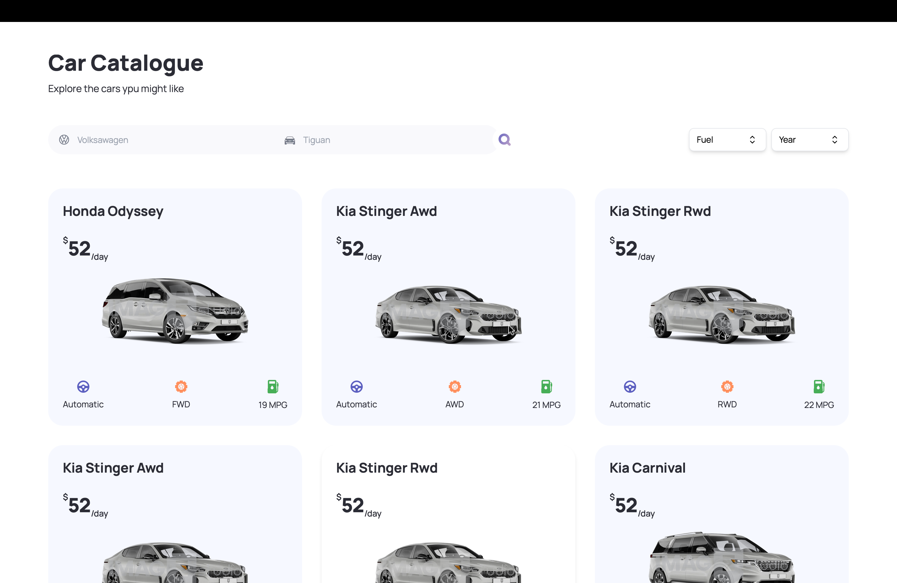

#### Car Rental Website

This Next.js and TypeScript-powered car rental website aims to provide a seamless car rental experience with the motto, "Find, book, or rent a car -- quickly and easily!" The website offers a range of functionalities, including user registration, advanced car search based on brand, model, fuel type, and build year. During the development phase, we tackled challenges related to TypeScript, form validation, and user authentication.

---

#### About

The car rental website is developed and maintained by [Md Musfikur Rahman](https://www.musfikur.com) . It aims to simplify the car rental process and provide a convenient platform for users to find and book cars. We hope the website enhances the car rental experience for users and contributes to a seamless journey.

---

#### Features

- **User Registration**: Users can register accounts to access additional features and services.
- **Advanced Car Search**: Users can search for cars based on brand, model, fuel type, and build year, allowing for precise filtering.
- **Booking System**: Users can book cars for specific dates and times, facilitating easy planning and scheduling.
- **User Authentication**: Secure user authentication ensures that only registered users can access certain features and functionalities.
- **Responsive Design**: The website is designed to be responsive, providing a consistent experience across various devices and screen sizes.

---

#### Technology Stack

- **Frontend**:
  - Next.js: A React framework for building server-side rendered and statically generated web applications.
  - TypeScript: A statically typed superset of JavaScript that enhances code quality and development experience.
- **Database**: Rapidapi API library
- **Authentication**: Specify authentication mechanism used OAuth
- **Deployment**:  Vercel

---

#### Challenges Faced

During the development of the car rental website, we encountered several challenges, including:
- **TypeScript Integration**: Adapting to TypeScript required additional effort in type declarations and ensuring type safety throughout the codebase.
- **Form Validation**: Implementing robust form validation mechanisms to ensure data integrity and user input validation.
- **User Authentication**: Developing a secure and reliable user authentication system to protect user data and access control.

---

#### Deployment

The car rental website is deployed on Vercel, ensuring reliable hosting and accessibility. The deployment process is automated and streamlined, allowing for quick updates and optimizations.

**Live Link**: [Car Rental Website Demo](https://carz-showcase.vercel.app)

To deploy the car rental website:
1. Clone the repository from GitHub.
2. Install dependencies using npm or yarn.
3. Configure environment variables as necessary.
4. Connect the project to the deployment platform and deploy using the provided tools or scripts.
5. Monitor the deployment status and access the live application URL.

---

#### Contributing

Contributions to the car rental website are welcome! Whether you want to suggest new features, report bugs, or submit code improvements, please follow these guidelines:
- Fork the repository and create a new branch for your changes.
- Commit your changes with descriptive messages.
- Open a pull request, explaining the purpose and impact of your changes.
- Participate in discussions and address feedback to ensure the quality of contributions.

---

#### Contact

For inquiries, feedback, or support, please contact the project maintainer(s) at [contact@musfikur.com](mailto:contact@musfikur.com).

---

**Screenshot**:

